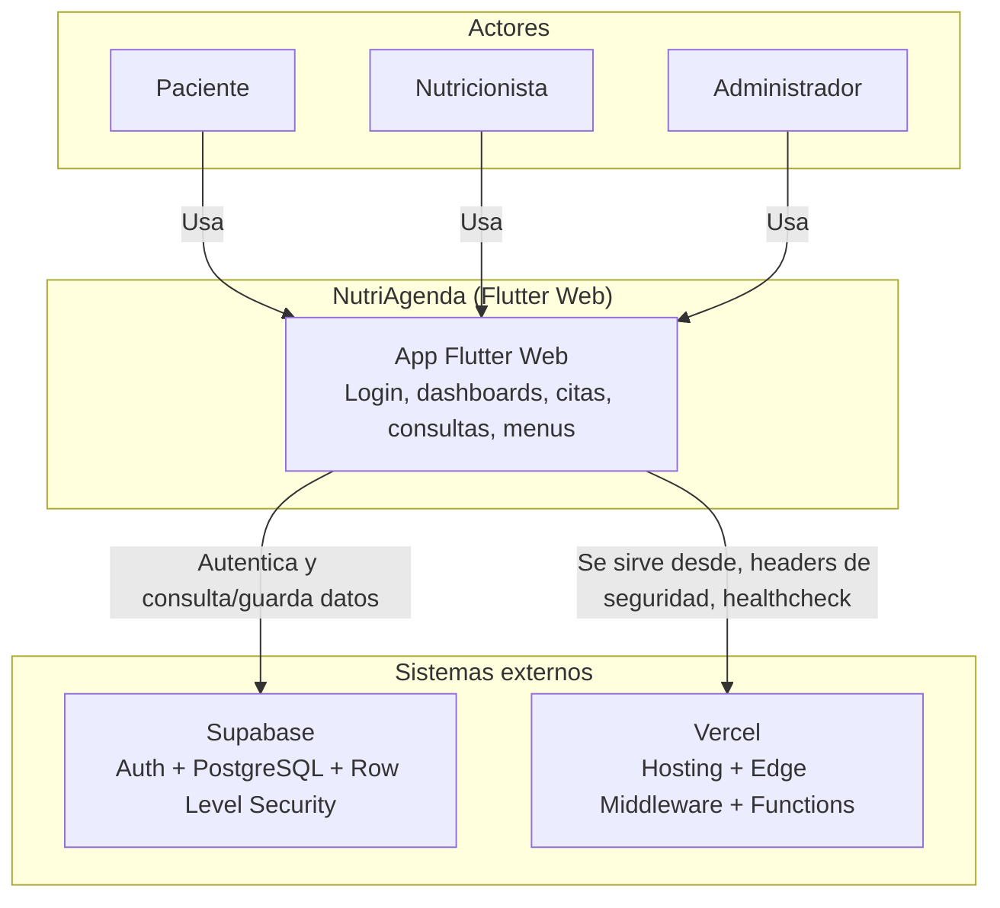

# Arquitectura de NutriAgenda

## Diagrama de contexto (Nivel 1 del modelo C4)

## Componentes principales

- **Cliente (Flutter Web):** una sola aplicación compilada a JavaScript, con pantallas separadas por rol (paciente, nutricionista, administrador) y navegación protegida mediante un `AuthGuard` que redirige al login si no hay sesión activa.
- **Backend como servicio (Supabase):** provee autenticación por correo/contraseña, una base de datos PostgreSQL con Row Level Security (RLS) que aplica las reglas de acceso directamente en la base de datos, no solo en el cliente, y una función SQL con `security definer` para evitar recursión en las políticas de roles.
- **Hosting (Vercel):** sirve el sitio estático generado por `flutter build web`, aplica headers de seguridad, expone un healthcheck en `/api/health`, y refuerza la protección de rutas privadas mediante Edge Middleware.

## Roles y flujo de datos

1. Un paciente o nutricionista se registra; un trigger de PostgreSQL crea automáticamente su fila en `profiles` con el rol correspondiente.
2. Las políticas de RLS determinan qué filas puede leer o escribir cada rol (por ejemplo, un nutricionista solo ve las citas donde él es el `nutricionista_id`).
3. El cliente Flutter nunca decide la seguridad por sí solo: aunque la interfaz oculte botones según el rol, la base de datos rechaza cualquier operación no autorizada.